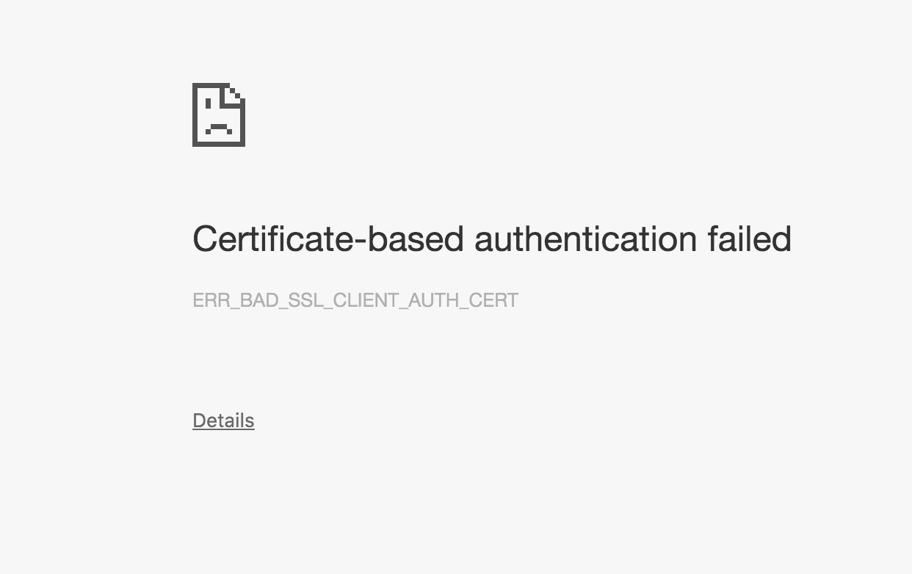

# Quick Start

## A note on security

This tutorial shows you how to quickly set up SG SSL. Note that the settings and passwords we use here are **not safe for production**, and only meant to get SG SSL working as quick as possible!  

## Install the plugin

First, [install SG SSL](2_installation.md) for your particular ES version on each node.

## Generating the keystore and truststore

For SSL to work, you have to place a **keystore** and a **truststore** containing all required certificates on each node.

SG comes with a script that will generate all required files for you. The truststore contains a generated Root CA certificate and can be used on all nodes equally. The keystore is generated for each node individually and contains the nodes own certificate plus its private key.

Besides that, certificates for the REST layer to be installed on your browser are also generated.

The script uses OpenSSL for generating all required artifacts. If you do not have OpenSSL already installed on your machine, please do so. If you cannot use OpenSSL on your machine, you'll need to find some other ways to obtain the required artifacts. 

In order to find out if you have OpenSSL installed, open a terminal and type

```
openssl version
```

If installed, this should print out the version number of your OpenSSL installation.

The scripts have been tested on Linux and OSX.

Steps to generate the required artifacts:

* Download SG SSL or clone the repository
* Change to the directory `example-pki-scripts`
* Execute `./example.sh`

**Note: if for any reason you need to re-execute the script, execute `./cleanup.sh` in the same directory first. This will remove all generated files**

## Copying the keystore and truststore files

The script generated a file called `truststore.jks`. Copy this file to the `config` directory of all ES nodes.

The script also generated three keystore files: 

* `node-0-keystore.jks`
* `node-1-keystore.jks`
* `node-2-keystore.jks`

The keystore files are individual per node. Copy `node-0-keystore.jks` to the `config` directory of your first ES node, `node-1-keystore.jks` to the second and so forth.

The config directory of your first ES node should now look like:

```
elasticsearch-2.2.0
│
└─── config
    │   elasticsearch.yml
    │   logging.yml
    │   node-0-keystore.jks
    │   truststore.jks
    ├─── scripts
    │    │   ...
    │ ...
 
```
## Configuring the plugin

SG SSL is configured in the `config/elasticsearch.yml` file of your ES installation. Add the following lines to this file, and do so for all nodes: 

```
searchguard.ssl.transport.keystore_filepath: node-0-keystore.jks
searchguard.ssl.transport.keystore_password: changeit
searchguard.ssl.transport.truststore_filepath: truststore.jks
searchguard.ssl.transport.truststore_password: changeit
searchguard.ssl.transport.enforce_hostname_verification: false
```

Note that you have to adjust the name of the keystore file (`node-0-keystore.jks` in this example) for each node separately. While it **is** possible to also use the same keystore file on each node, we recomment installing a seperate file on each node, because this is closer to a production setup.

## Testing the installation

Your nodes are now ready to talk SSL to each other! Just start ES as normal, and watch the logfile. The nodes should start up without error. You can safely ignore the following infos and warnings in the logfile:

```
INFO: Open SSL not available because of java.lang.ClassNotFoundException:
 org.apache.tomcat.jni.SSL
```

This simply means that you use JCE (Java Cryptography extensions) as your SSL implementation. On startup, SG looks for OpenSSL support on your system via the netty-tcnative library. Since we have not installed it yet, SG falls back to the built-in Java SSL implementation.

```
WARN: AES 256 not supported, max key length for AES is 128. 
To enable AES 256 install 'Java Cryptography Extension (JCE) 
Unlimited Strength Jurisdiction Policy Files'
```

If you use Oracle JDK, the length of the cryptographic keys is is limited for judical reasons. You'll have to install the [Java Cryptography Extension (JCE) 
Unlimited Strength Jurisdiction Policy Files](http://www.oracle.com/technetwork/java/javase/downloads/jce8-download-2133166.html) to use longer keys.

We have not configured HTTPS for the REST-API yet, so you should also try to access ES via a browser by typing

```
http://127.0.0.1:9200/
```

This should give you some information about ES in JSON format. You can also display some configuration information from SG SSL directly by visiting:

```
https://127.0.0.1:9200/_searchguard/sslinfo?pretty
```
Which should display something like this:


## Configuring HTTPS

Simply speaking, a client using the REST-API must be configured in a similar fashion than the participating nodes. In our case, the client will be a browser. 

There is one difference though: We said earlier that each node has to authenticate itself in order to being able to join the cluster. For a browser talking HTTPS to ES this so called "client authentication" is optional. We will set it up later.

In order to activate and configure HTTPS, add the following lines to the `config/elasticsearch.yml` file of your ES installation on each node:

```
searchguard.ssl.http.enabled: true
searchguard.ssl.http.keystore_filepath: node-0-keystore.jks
searchguard.ssl.http.keystore_password: changeit
searchguard.ssl.http.truststore_filepath: truststore.jks
searchguard.ssl.http.truststore_password: changeit
```

You'll notice that this configuration is nearly identical with the transport layer configuration we did before. While you can use different certificates for the transport layer and the HTTPS layer, we'll just use the same certificates for a quick start.

Now start your node(s) and try to connect with HTTP first:

```
http://127.0.0.1:9200/
```

You should see an error message in the browser. Now try with HTTPS:

```
https://127.0.0.1:9200/
```

This should give you a warning in the browser. Since we generated all certificates ourself, the browser does not trust the certificate it got from ES and informs you about that. You can either ignore the warning and accept the unknown certificate. Or, import the Root CA the script generated in the browser. Both appoaches differ from browser to browser and OS to OS.

### Importing the Root CA

In order to make your browser trust the certificates handed out by ES, you need to import the Root CA, and, for some browsers or OS, additionally trust this certificate.

How this is done varies. For example, Firefox has it's own list of trusted CAs. You can find them under Settings -> Advanced -> Certificates -> Show Certificates. Chrome on OSX uses the operating systems keychain. Please refer to your browser and/or OS documentation to find out how to import Root CAs on your particular system.

You will find the certificate to import in the directory `example-pki-scripts/ca`. Import the certificate named `root-ca.crt`. If you access 

```
https://127.0.0.1:9200/
```

The warnings should be gone. Congratulations. Your complete ES communication is encrypted now!

### Optional: Client authentication

While it is common for HTTPS that only the servers identity is verified, SSL is not limited to that. This means that you can configure SG SSL to only accept HTTPS connections from trusted sources. In our example, from trusted browsers.

First, let's enable client authentication. Add the following line to the `config/elasticsearch.yml` file of your ES installation on each node:

```
searchguard.ssl.http.enforce_clientauth: true
```

After restarting the node(s), try again to connect via your browser. You should see an error message like this:



This means that ES is asking your browser to identify itself. Since we have not installed any certificate for that purpose so far, ES rejects the connection.

Similar to importing the Root CA, we now need to install a certificate that the server trusts on the browser. Luckily, the `example.sh` script also generated those for us. The certificates are called `kirk` and `spock`, and were generated in different formats. Which one you need to use again depends on your browser and OS.

After importing either one of the certificates, try to connect to ES again with your browser. This time, the browser asks you which certificate you want to us to identify yourself:


In most cases, there will be only one certificate to choose from, since client authentication is not common for most HTTPS servers. So, choose "kirk" and click on ok. The connection should succeed, and you should again see the ES status information in JSON format.

If you visit the SG SSL info page again by entering:

```
https://127.0.0.1:9200/_searchguard/sslinfo?pretty
```
You should now see an output similar to this:


Note the `principal` entry, which displays some information about the client certificate you used to identify yourself to ES.

At this point, no client without a valid certificate can connect to ES. 
