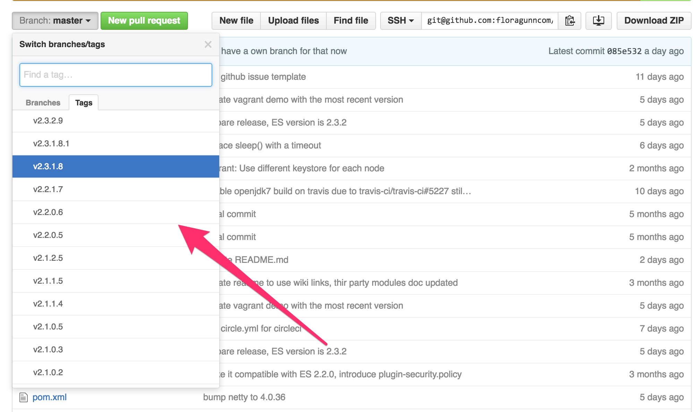
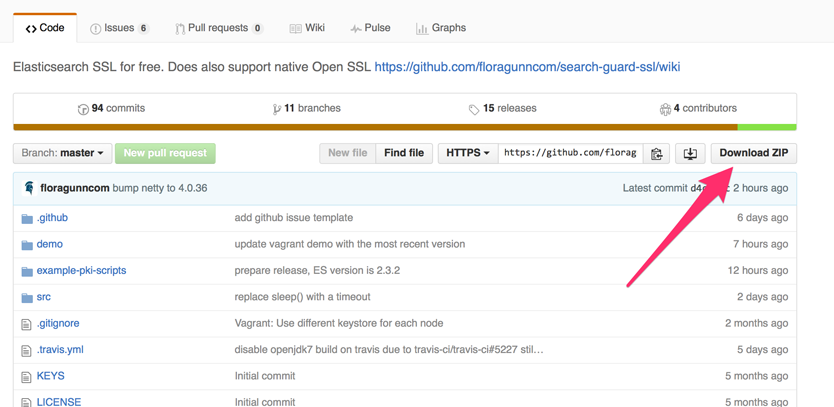
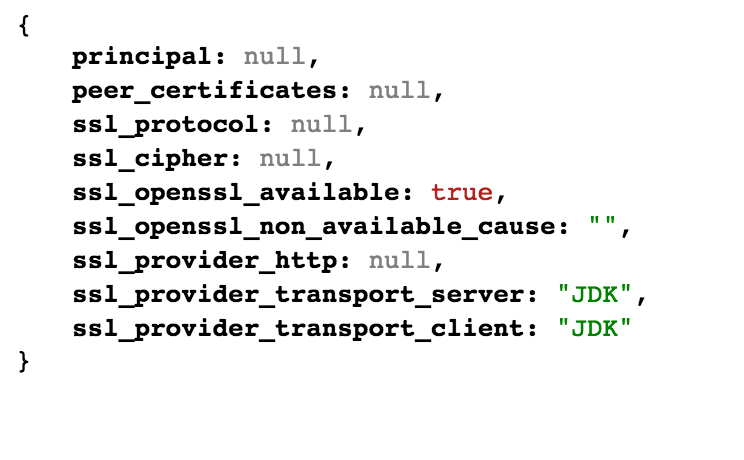
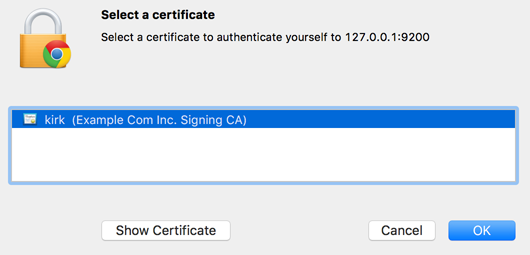
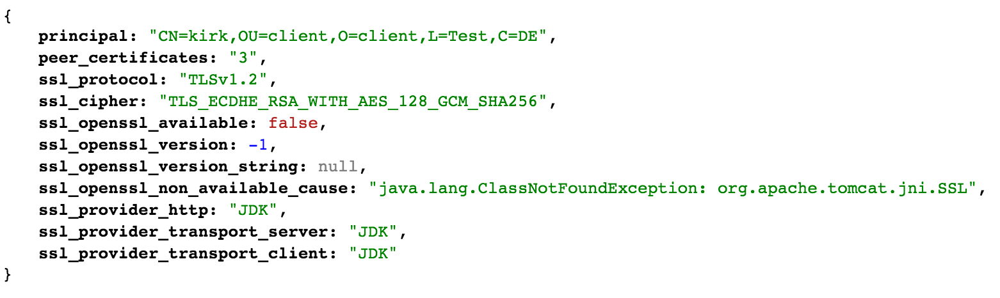

<!---
Copryight 2016 floragunn UG (haftungsbeschränkt)
-->

# Quick Start

## A note on security

This tutorial shows how to quickly set up SG SSL. Note that the settings and passwords we use here are **not safe for production**, and only meant to get SG SSL working as quickly as possible!  

## Install the plugin

First, [install SG SSL](installation.md) for your particular ES version on each node. For installation instructions and to figure out which SG version you need for your Elasticsearch installation, please refer to the chapter [Installation](installation.md).

## Generating the keystore and truststore

For SSL to work, you have to have a **keystore** and a **truststore** containing all required certificates and keys on each node. If you  have knowledge about TLS, or already a PKI infrastructure in place, you can generate the required certificates on your own. Otherwise you can use one of the following methods:

### Using the TLS generator service

We have set up a web-based service to generate all required artefacts for you. You need to provide your email address and organisation name, and can specify up to 10 hostnames. The certificates, key- and truststore files are generated in the background, and we'll send you a download link once everything is ready.

We need your email to send the download link, while the organisation name will become part of the generated root CA.

You should generate one certificate per Elasticsearch node.

You can find the TLS generator service here:

[TLS certificate generator](https://floragunn.com/tls-certificate-generator/)

### Using the example PKI scripts

SG comes with scripts that will generate all required files for you. The scripts have been tested on Linux and OSX.

The script uses OpenSSL for generating all required artifacts. If you do not have OpenSSL already installed on your machine, please do so. If you cannot use OpenSSL on your machine, you'll need to find some other ways to obtain the required files, or use the TLS certificate generator service mentioned above. In this case, please refer to the chapter [Certificates](certificates.md). 

In order to find out if you have OpenSSL installed, open a terminal and type

```
openssl version
```

If installed, this should print out the version number of your OpenSSL installation. Make sure its at least version 1.0.1k.

The scripts will generate a truststore file containing a generated root certificate. The truststore file can be used on all nodes equally.

In order to generate the required artifacts, please execute the following steps:

#### Download SG SSL or clone the repository

In order to obtain and run the scripts, you need to download the SG SSL source code onto your machine.

If you have git installed on your machine, open a terminal, and change to the directory where you want to download SG SSL. Type:

```
git clone https://github.com/floragunncom/search-guard-ssl.git
```

You should see something like:

```
Cloning into 'search-guard-ssl'...
```

on the command line. The repository is now being downloaded on your computer.

If you do not have git installed, and do not want to install it, you can also download the source files as a zip archive directly from github. First, visit the repository at this URL: 

```
https://github.com/floragunncom/search-guard-ssl
```

Choose the version to download:



In order to figure out which SG SSL version you need for your particular ES version, refer to the chapter ["Installation"](installation.md), or visit the version matrix at our [github Wiki](https://github.com/floragunncom/search-guard-ssl/wiki)

Use the "Download as zip" button to download the archive:



Save and unzip the archive in a directory of your choice.

#### Execute the example script

Open a terminal and cd into the directory where you downloaded or extracted the SG SSL source code to. You'll find a folder called `example-pki-scripts`. Change to this folder.

The script we need to execute is called `./example.sh`. Make sure you have execute permissions on this file (chmod the permissions if needed) and execute it. All required artifacts are now generated. If execution was successful, you'll find a couple of generated files and folders inside the `example-pki-scripts` folder.

####Dealing with "keytool command not found" error
Depending on your JDK type and `PATH` configuration, you may get this error after executing `./example.sh`. To fix it, replace the path to each call of `keytool` in `gen_client_node_cert.sh`,`gen_node_cert.sh`, and `gen_root_ca.sh`. You can find the path to keytool (if installed on your system) by using `locate keytool`. However, for Oracle JDKs, it is located in `~path_to_jdk/bin`.

**If for any reason you need to re-execute the script, execute `./clean.sh` in the same directory first. This will remove all generated files automatically.**

## Copying the keystore and truststore files

Now that all required artifacts are in place, we need to copy them to Elasticsearch.

On each node, place the `keystore.jks` and `truststore.jks` file in a directory readable by the user that runs Elasticsearch. Make sure that also the files are readable by this user. For simplicity, we use the `config` directory of Elasticsearch in this example.

If you have used the example PKI script, it generated three keystore files: 

* `node-0-keystore.jks`
* `node-1-keystore.jks`
* `node-2-keystore.jks`

If you have used the TLS generator, the names of these files differ.

The keystore files are specific per node. Copy `node-0-keystore.jks` to the `config` directory of your first ES node, `node-1-keystore.jks` to the second and so forth. 

The config directory of your first ES node should now look like:

```
elasticsearch-2.2.0
│
└─── config
    │   elasticsearch.yml
    │   logging.yml
    │   node-0-keystore.jks
    │   truststore.jks
    ├─── scripts
    │    │   ...
    │ ...
 
```
## Configuring the plugin

SG SSL is configured in the `config/elasticsearch.yml` file of your ES installation. Stop any running ES node and add the following lines to this file. It does not matter where in the config file you add them, so we'll just append them to the end.

```
searchguard.ssl.transport.keystore_filepath: node-0-keystore.jks
searchguard.ssl.transport.keystore_password: changeit
searchguard.ssl.transport.truststore_filepath: truststore.jks
searchguard.ssl.transport.truststore_password: changeit
searchguard.ssl.transport.enforce_hostname_verification: false
```

This has to be done for all nodes of your cluster. Note that you have to adjust the name of the keystore file (`node-0-keystore.jks` in this example) for each node separately. So on your first ES node you'd use 

```
searchguard.ssl.transport.keystore_filepath: node-0-keystore.jks
```

And on the second node:

```
searchguard.ssl.transport.keystore_filepath: node-1-keystore.jks
```

And so on. While it **is** possible to use the same keystore file on each node, we recommend installing a seperate file on each node, because this is closer to a production setup.

## Testing the installation

Your nodes are now ready to talk TLS to each other! Just start ES as normal, and watch the logfile. The nodes should start up without error. You can safely ignore the following infos and warnings in the logfile:

```
INFO: Open SSL not available because of java.lang.ClassNotFoundException:
 org.apache.tomcat.jni.SSL
```

This simply means that you use JCE (Java Cryptography extensions) as your TLS implementation. On startup, SG looks for OpenSSL support on your system. Since we have not installed it yet, SG falls back to the built-in Java SSL implementation.

```
WARN: AES 256 not supported, max key length for AES is 128. 
To enable AES 256 install 'Java Cryptography Extension (JCE) 
Unlimited Strength Jurisdiction Policy Files'
```

If you use Oracle JDK, the length of the cryptographic keys is is limited for judical reasons. You'll have to install the [Java Cryptography Extension (JCE) 
Unlimited Strength Jurisdiction Policy Files](http://www.oracle.com/technetwork/java/javase/downloads/jce8-download-2133166.html) to use longer keys. For our quickstart tutorial, you can ignore this warning for the moment.

**Congrats. Your ES nodes now talk TLS to each other on the transport layer!**

We have not configured HTTPS for the REST-API yet, so you can still access ES via a browser (or curl for that matter) as usual by typing

```
http://127.0.0.1:9200/
```

You can display some configuration information from SG SSL directly by visiting:

```
http://127.0.0.1:9200/_searchguard/sslinfo?pretty
```

Which should display something like this:



## Configuring HTTPS

Now that the traffic between the nodes is TLS-encrypted, we want to make sure that also the traffic via the REST-API is secure. Simply speaking, a client using the REST-API must be configured in a similar way as the participating nodes. In our case, the client will be a browser, but you can also use curl.

**A note on using curl: Since the generated root certificate is self-signed, it is not trusted by default. When accessing ES via a browser, this is not a problem: The browser will give you a warning and the possibility to import the Root CA. When using curl, you need to add the `--insecure` flag in order to skip the certificate validation. Otherwise, curl will fail with a certificate validation error.**

There is one difference though: We said earlier that each node has to authenticate itself in order to being able to join the cluster. For a browser talking HTTPS to ES this so called "client authentication" is optional. We will set it up later.

In order to activate and configure HTTPS, stop any running nodes and add the following lines to the end of your `config/elasticsearch.yml` file of your ES installation on each node:

```
searchguard.ssl.http.enabled: true
searchguard.ssl.http.keystore_filepath: node-0-keystore.jks
searchguard.ssl.http.keystore_password: changeit
searchguard.ssl.http.truststore_filepath: truststore.jks
searchguard.ssl.http.truststore_password: changeit
```

You'll notice that this configuration is nearly identical with the transport layer configuration we did before. While you can use different certificates for the transport layer and the HTTPS layer, we'll just use the same certificates for our tutorial.

Now start your node(s) and try to connect with HTTP first:

**Note: The generated certificates are valid for the IP `127.0.0.1` only. So, in the following examples, do not use `localhost`, but `127.0.0.1` instead. If you use localhost, you'll see an error message in the browser like: "The certificate is only valid for the following names: node-0.example.com, 127.0.0.1 ..."**

```
http://127.0.0.1:9200/
```

Since we configured SG SSL to only accept SSL/TLS connections, you should see an error messages in the browser and also in the logfiles. This is expected and means that SG SSL rejects all non-SSL connections.

Now try with HTTPS:

```
https://127.0.0.1:9200/
```

This should give you the a warning from the browser regarding our self signed certificate. Since we generated all certificates ourself, the browser does not trust the root CA and informs you about that. You can either ignore the warning and accept the unknown certificate. Or, import the root CA the script generated in the browser. Both appoaches differ from browser to browser and OS to OS.

### Importing the Root CA

In order to make your browser trust our generated certificates, you need to import the Root CA, and, for some browsers or OS, additionally trust this certificate.

How this is done varies. For example, Firefox has it's own list of trusted CAs. You can find them under Settings -> Advanced -> Certificates -> Show Certificates. Chrome on OSX uses the operating systems keychain. Please refer to your browser and/or OS documentation to find out how to import Root CAs on your particular system.

You will find the certificate to import in the directory `example-pki-scripts/ca`. Import the certificate named `root-ca.crt`. If you now access 

```
https://127.0.0.1:9200/
```

The warnings should be gone. Congratulations. Your complete ES communication is encrypted now!

### Optional: Client authentication

While it is common for HTTPS that only the servers identity is verified, SSL is not limited to that. This means that you can configure SG SSL to only accept HTTPS connections from trusted clients. In our example, from trusted browsers. By doing so, you can set up an authentication schema solely based on certificates. While this is far from sophisticated authentication/authorization based on groups and access rights, it might be already sufficient for your use case. 

First, let's enable client authentication. Add the following line to the `config/elasticsearch.yml` file of your ES installation on each node:

```
searchguard.ssl.http.clientauth_mode: REQUIRE
```

After restarting the node(s), try again to connect via your browser. You should see an error message like "Certificate-based authentication failed".

This means that SG SSL is asking your browser to identify itself. Since we have not installed any certificate for that purpose so far, the client cannot do so and SG SSL rejects the connection.

Similar to importing the Root CA, we now need to install a certificate that your ES nodes trust. The `example.sh` script also generated those for us. The certificates are called `kirk` and `spock`, and have been generated using the same root CA as for the node certificates. The client certificates have been generated in different formats. Which one you need to use again depends on your browser and OS.

After importing either one of the certificates, try to connect to ES again with your browser. This time, the browser asks you which certificate you want to us to identify yourself:



Choose "kirk" or "spock", depending on which one you have installed, and click on ok. The connection should succeed, and you should again see the ES status information in JSON format.

If you visit the SG SSL info page again by entering:

```
https://127.0.0.1:9200/_searchguard/sslinfo?pretty
```

You should now see an output similar to this:



Note the `principal` entry, which displays some information about the client certificate you used to identify yourself to ES.

At this point, no client without a valid certificate can connect to ES. 

**Congratulations, your ES setup is now secured via SG SSL. No unauthorized client can connect, and the traffic is secured against sniffing and tampering.**
